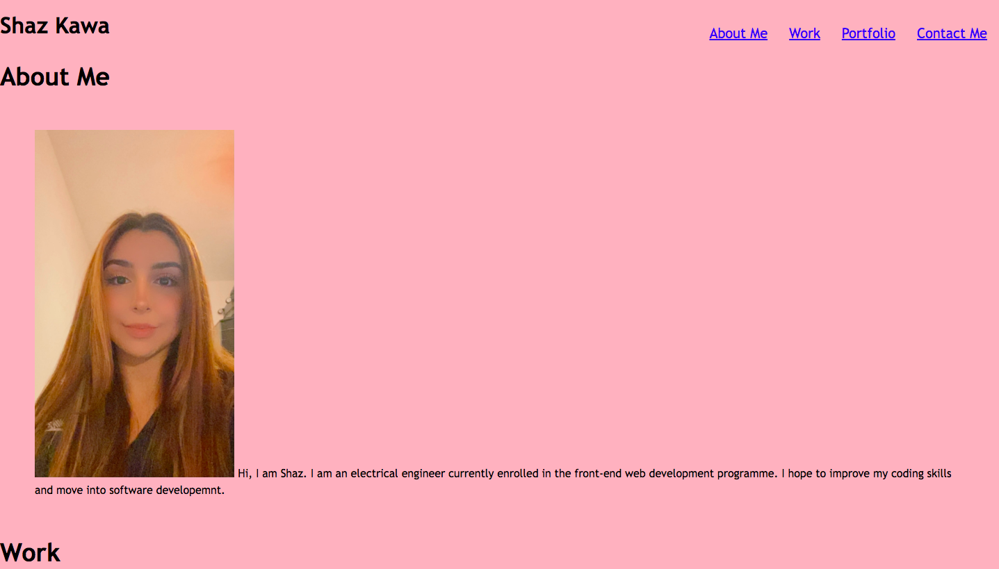

# Challenge2

## Description

The challenge was to create a portfolio. The portfolio was to include my name, a picture of me, something about my work and how to contact me. This was to use and implement new CSS features that we have covered in class, such as using flex box and grid layouts, as well as starting to create a professional portfolio website that I can show to employers. 
In this challenge, I have learnt to implement a grid layout in my work. I have also learnt how to position different elements to be compatible with diiferent screen widths. Once more, I have also learnt how to link my images and texts in my website to either a delpoyed page or the relevant section in my webpage. 
Provide a short description explaining the what, why, and how of your project. Use the following questions as a guide:

## Installation

Firstly, I created a wireframe by hand to help plan and guide me when developing my portfolio. After downloading the starter code, I began to add all my semantic elements to the HTML file that I wanted to be included. The hardest challenge was nesting the child divs into the parent div to plan my grid layout. I used specific IDs and classes to help me style my elements. Once the HTML file has been completed, I began to style from top to bottom. Although I did seek a tutor and read many online resources, I found it very difficult to completely style my webpage to match my wireframe. This portfolio is something I will be constantly updating until it is the layout I desire. Once completed, I deployed the page on Github. 

Here is the link to my github: https://github.com/shazzy-kawa/Challenge2.git
Here is the link to my deployed webpage: https://shazzy-kawa.github.io/Challenge2/
Here is a screenshot of the webpage:

## Usage

The navigation bar navigates to all relevant sections in the webpage. The project photos also navigate to the deployed projects. The LinkedIn link at the footer also navigates to the LinkedIn site. 

## Credits

I have used the bootcamp videos to help me develop my page. I have also used the following sources with specific CSS problems.
Source 1 : https://www.w3schools.com/css/css_grid.asp
Source 2: https://www.w3schools.com/css/css3_flexbox.asp
## License

This was completed using an MIT license.
